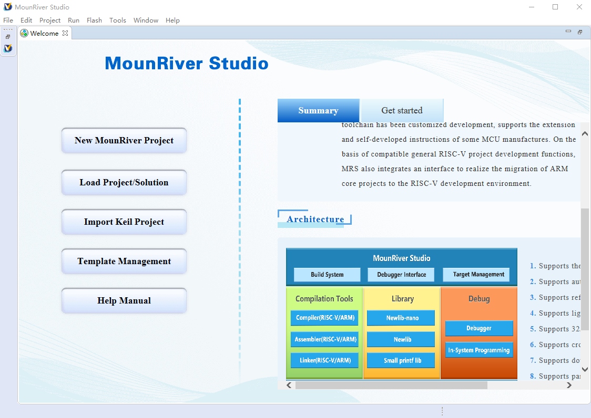
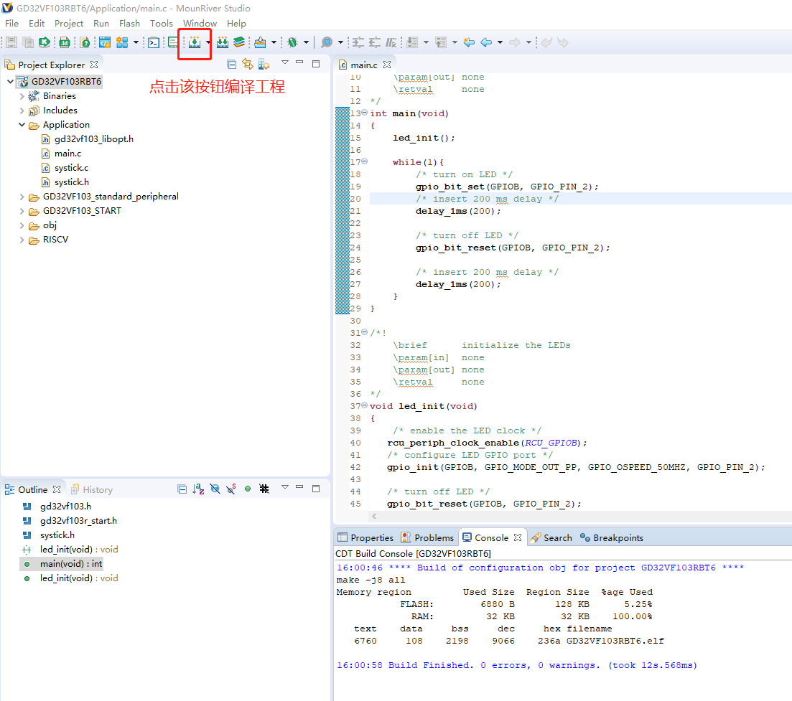
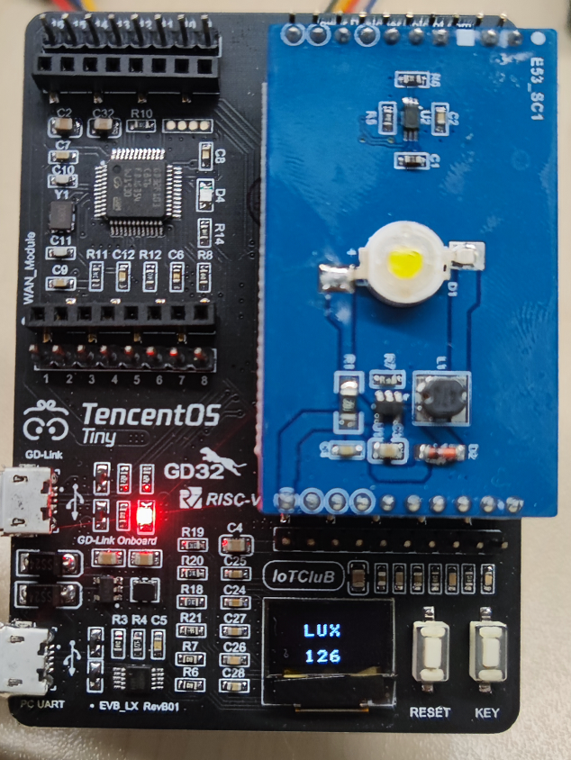
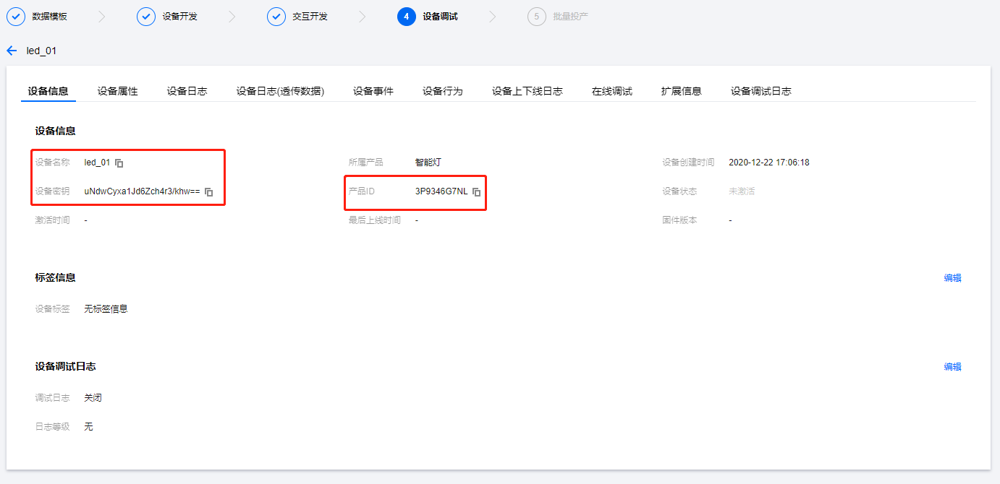
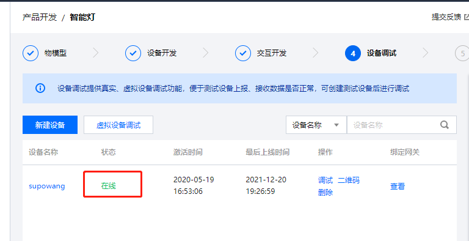
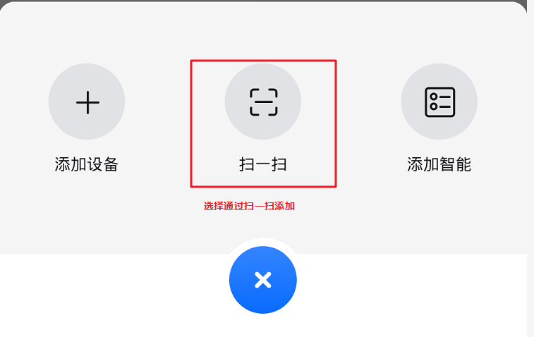
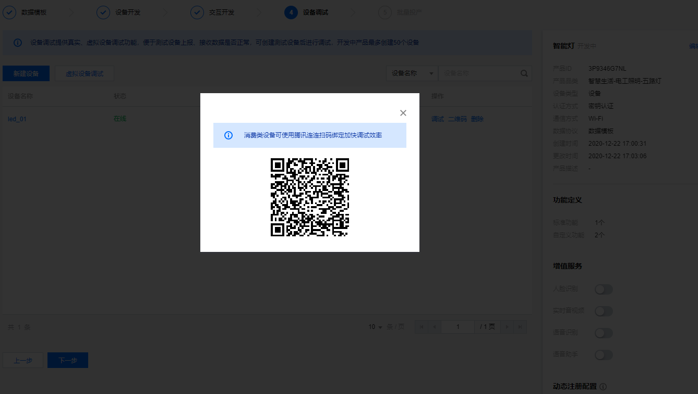
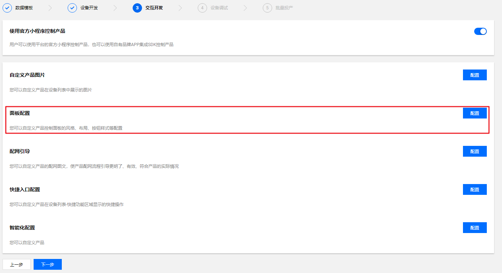

# GD32V-RISC-V 物联网操作系统 TencentOS-Tiny 案例实践指南

| Revision | Date       | Description                                             |
| -------- | ---------- | ------------------------------------------------------- |
| 2.0      | 2021-12-20 | GD32V-RISC-V 物联网操作系统 TencentOS-Tiny 案例实践指南 |

## 一、定制开发板 EVB_LX 硬件简介

### 1.1 开发板简介

EVB_LX+是腾讯物联网操作系统 TencentOS tiny 团队联合兆易创新（GD32）、南京厚德物联网有限公司三方合作设计的一款物联网评估板，用于 TencentOS tiny 基础内核、RISC-V 新 IP 核架构和 IoT 组件功能体验和评估。
开发板功能图如下所示：


### 1.2 开发板特性

**CPU** ：GD32VF103RBT6, 108MHz，128K Flash，32KB SRAM

**显示屏** ：OLED，64\*32 分辨率

**电源特性** ：Micro USB 接口，5V 供电，内部有 5V 转 3.3V 的 DCDC，MCU 供电电压为 3.3V，系统 IO 电压也为 3.3V

**按键** ：一个复位按键，一个功能按键

**外部扩展存储** ：SPI FLASH

**LED 指示灯** ：上电指示 LED，红色；一个用户定义 LED，蓝色

**调试接口** ：板载 GD-Link 下载调试器，UART2 串口连接 PC

**XTAL** ：8MHz，32.768KHz

**传感器扩展接口 E53 Interface** ：支持 E53 传感器案例扩展板（支持 UART、SPI、IIC、GPIO、ADC、DAC 等）

**网络模块扩展接口 WAN Interface** ：支持多种无线通信模组扩展（UART&SPI&GPIO）

**操作系统支持** ：TencentOS tiny

### 1.3 开发板硬件详解

#### 1.3.1 电源电路

- 电源稳压电路
  外部 USB 输入电压一般为 5V，但这并不能直接作为电源给 EVB_LX 供电，EVB_LX 上的元器件供电电压范围普遍在 1.8V-3.6V，推荐电压均为 3.3V，（BC35 供电范围是：3.1V-4.2V，推荐电压 3.8V，使用 3.3V 也可以正常工作），因此需要将 5V 的电平转换成 3.3V 供给 EVB_LX 开发板使用，这里使用 RT8059 作为 3.3V 稳压器芯片。
  RT8059是一款高效率脉冲宽度降压型DC/DC转换器。输入电压2.8V-5.5V，输出电压可调范围为：0.6V-Vin，输出电流可以达到1A。在我们提供的电路中将输出调节至3.3V，让开发板正常工作。
  

#### 1.3.2 GD32V 最小系统电路

单片机最小系统或者叫最小硬件单元电路，指用最少元器件组成的单片机可以正常工作的系统。最小系统基本由电源、单片机、晶振、复位电路、程序烧录接口组成，电源使用 3.3V 直接供电，其他部分原理图如下：


#### 1.3.3 USB 电平转换电路

USB 电平转换电路是用于 MCU 和 PC 通信的场景中。PC 机上的通信接口使用 USB 接口，相应的电平逻辑需要遵照 USB 电平规则，而 MCU 的串行通信接口是串口，相应电平需要遵循 TTL 原则。为了使两者可以互相通信，就需要一个电平转换器，EVB_LX 上使用了 CH340 芯片作为转换器，CH340 外围只需要接很少的元器件即可以实现 USB 总线转接，使用非常方便也广泛运用在 USB 转 TTL 工具上，电路如下：


#### 1.3.4 OLED 显示电路

OLED 液晶显示模块用来向用户显示系统状态、参数或者要输入系统的功能。为了展示良好的视觉效果，模块使用 SSD1306 驱动的 OLED 显示屏，分辨率为 64\*32。SSD1306 芯片专为共阴极 OLED 面板设计，嵌入了对比控制器、显示 RAM 和晶振，并减少了外部器件和功耗，有 256 级亮度控制。
该款 OLED 使用 IIC 接口，由于 IIC 接口空闲时引脚要上拉，因此下面的原理图中接了 10k 电阻上拉，然后才接入 MCU 引脚。


#### 1.3.5 用户按键

开发板带有一个系统 Reset 按键，和一个功能按键。复位按键是直接接入 GD32V MCU 的硬件复位 Pin，按下复位按键，系统自动重启复位。功能按键可以提供给开发者做功能定义开发，都是使用 GPIO 口，方向为输入，低电平有效。其原理图如下图所示。


#### 1.3.6 LED 程序指示灯

为了方便项目开发调试，EVB_LX 开发板接出来一个 LED 灯，供用户自己设置状态使用，该 LED 灯接 MCU 的 PB2 引脚，当 PB2 引脚输出高电平时，会点亮 LED 灯。


#### 1.3.7 Flash 存储电路扩展

开发板带有一个 SPI Nor Flash 芯片扩展，用户存储一部分用户数据和存储空间扩展，电路图如下：


#### 1.3.8 多串口切换电路

开发板带有多串口切换功能，通过拨 S2 开关可以切换串口映射关系，开关切换到 PC AT，可以使用 PC 机上的串口助手发送 AT 命令来调试 WAN 口的通信模组；当开关切换到 MCU AT，是通过 GD32V MCU 的串口直接来发送 AT 指令控制通信模组，同时 CH340 串口连接 PC 可以做日志输出。串口切换电路图如下：


#### 1.3.9 E53 传感器扩展接口

开发板设计有 E53 接口的传感器扩展板接口，该接口可兼容所有 E53 接口的传感器扩展板，实现不同物联网案例场景的快速搭建。该接口可接入 UART、SPI、I2C、ADC 等通信协议的传感器，其原理图如下图所示。


#### 1.3.10 WAN 通信模块扩展接口

开发板设计有通信扩展板的扩展接口，该接口可接入 WIFI、NB-IoT、2G、腾讯定制 IoT 模组、LoRaWAN 等不同通信方式的通信扩展板，以满足不同场景上云的需求，其原理图如下图所示。


#### 1.3.11 开发板部分引脚和模块映射关系


### 1.4 开发板开箱安装指南

#### 1.4.1 检查配套设备


打开开发套件盒子后，开发者可以找到开发板主板，一个 WAN 口 wifi 扩展板 ESP8266、和一个智慧路灯传感器扩展板 E53_SC1(如需要更多传感扩展板可自行找合作供应商（物联网俱乐部）购买），如上图所示。

#### 1.4.2 安装 WAN 口 WiFi 模块


#### 1.4.3 安装传感器扩展板


根据您开发套件配套的传感扩展板安装其中一个即可。

#### 1.4.4 连接 Micor USB 线

Micro USB 线的功能是供电及调试，将线一头与开发板的 Micro 接口 (GD-Link) 连接，另一头接到电脑的 USB 口上。(程序下载完了，也可以把 usb 线接到 pc uart 的端口，用于打印日志)


## 二、定制开发板 EVB_LX 软件开发环境准备

### 2.1 MounRiver Studio IDE 下载与安装

MounRiver Studio（MRS）是一款面向 RISC-V、ARM 等内核 MCU 的集成开发环境，提供专业嵌入式项目所需的开发、调试环境、烧录工具已经完善的项目管理能力，是目前使用相对方便的 GD32V 开发环境。这里我们使用该 IDE 来进行 risc-v 相关应用开发。首先，我们到 MounRiver Studio 官网下载软件安装包，下载地址：http://www.mounriver.com/download


安装完成后打开软件可以进入到欢迎界面



### 2.2 新建 GD32V 工程

菜单栏点击 File->New->MounRiver project 开始创建工程


进入工程向导后，按照如下图所示选择芯片，填写工程信息。


完成后会生成工程，如图所示：


### 2.3 编译下载调试 GD32V 工程

MRS IDE 导入的是默认的 LED 闪灯程序，由于我们开发板 EVB LX 的 LED 灯跟兆易创新官方评估板的 GPIO 不一样，使用的 GPIOB，Pin2，这里我们修改下 main.c 中的 led 初始化代码。
将如下代码复制替换 main.c 文件中的全部代码：

```
#include "gd32vf103.h"
#include "gd32vf103r_start.h"
#include "systick.h"

void led_init(void);

/*!
    \brief      main function
    \param[in]  none
    \param[out] none
    \retval     none
*/
int main(void)
{
    led_init();

    while(1){
        /* turn on LED */
        gpio_bit_set(GPIOB, GPIO_PIN_2);
        /* insert 200 ms delay */
        delay_1ms(200);

        /* turn off LED */
        gpio_bit_reset(GPIOB, GPIO_PIN_2);

        /* insert 200 ms delay */
        delay_1ms(200);
    }
}

/*!
    \brief      initialize the LEDs
    \param[in]  none
    \param[out] none
    \retval     none
*/
void led_init(void)
{
    /* enable the LED clock */
   rcu_periph_clock_enable(RCU_GPIOB);
   /* configure LED GPIO port */
   gpio_init(GPIOB, GPIO_MODE_OUT_PP, GPIO_OSPEED_50MHZ, GPIO_PIN_2);

   /* turn off LED */
   gpio_bit_reset(GPIOB, GPIO_PIN_2);
}
```

完成代码拷贝覆盖后，点击如下图所示图标编译工程，编译完成后可以在控制台输出看到编译结果。



如下图所示，点击 debug 按钮，就可以进入调试模式，程序下载到开发板上，可以打断点、单步、跳步执行，全速执行，查看寄存器，反汇编、内存等


执行全速运行后，可以看到开发板上的用户 LED 灯间隔闪烁。

除了调试按钮外，我们也可以点击下载按钮直接将程序烧写到开发板上，如下图所示：


本实验代码下载链接：https://share.weiyun.com/4XXWaOzU 密码：cy4m5f

GD32V-RISC-V 物联网操作系统 TencentOS-Tiny 案例实践指南 (20211220)\SourceCode\EVB_LX_GD32V_LED.rar

## 三、TencentOS Tiny 内核移植

### 3.1 准备裸机工程

移植 TencentOS Tiny 内核前，我们先准备一个简单的点灯工程，这里跟前面的步骤一样，我们先使用 MounRiver Studio IDE 基于 GD32V 生成基础工程；
基础的裸机工程包含 LED、串口、液晶显示屏驱动。这里我把裸机工程给大家准备好了，大家下载 EVB_LX_GD32V_Printf_Lcd.rar 解压后使用 IDE 打开即可。
裸机工程代码下载链接：https://share.weiyun.com/4XXWaOzU 密码：cy4m5f

GD32V-RISC-V 物联网操作系统 TencentOS-Tiny 案例实践指南 (20211220)\SourceCode\EVB_LX_GD32V_Printf_Lcd.rar

### 3.2 准备内核源码

在 TencentOS Tiny 官方项目仓下载内核代码，下载地址：https://github.com/Tencent/TencentOS-tiny

拷贝如下目录的内核代码到新建的 TencentOS-Tiny 文件夹备用（请严格按照一下目录拷贝，不需要拷贝多余的）

| 一级目录   | 二级目录 | 三级目录 | 四级目录  | 五级目录 | 说明                                                  |
| ---------- | -------- | -------- | --------- | -------- | ----------------------------------------------------- |
| arch       | arm      | risc-v   | common    |          | TencentOS tiny 中断 tick 相关代码                     |
|            |          |          | rv32i     | gcc      | TencentOS Tiny risc-v 调度汇编 GCC                    |
|            |          |          | bumblebee | gcc      | GD32V 中断配置相关代码                                |
| kernel     | core     |          |           |          | TencentOS tiny 内核源码                               |
|            | hal      |          |           |          | TencentOS tiny 驱动抽象层                             |
|            | pm       |          |           |          | TencentOS tiny 低功耗源码                             |
| TOS_CONFIG |          |          |           |          | TencentOS tiny 配置头文件，用户自定义，从模板修改过来 |

这里只介绍 TencentOS tiny 的内核移植，所以这里只需要用到 arch、kernel 两个目录下的源码。

将全部内核源码复制到工程目录下，如下图：


然后我们在工程界面按 F5 刷新工程，就可以在源码目录看到 TencentOS Tiny 的内核源码了，如图所示：


### 3.3 添加内核初始化和相关任务代码

1）首先在 main.c 中包含内核头文件 #include "tos_k.h"

2）添加 Tick 处理函数 eclic_mtip_handler

```
void eclic_mtip_handler() {
    port_systick_config((uint32_t)k_cpu_cycle_per_tick);
    if (tos_knl_is_running()) {
        tos_knl_irq_enter();
        tos_tick_handler();
        tos_knl_irq_leave();
    }
}

```

3. 新建两个测试任务

```
#define TASK1_STK_SIZE       1024
k_task_t task1;
uint8_t task1_stk[TASK1_STK_SIZE];


#define TASK2_STK_SIZE       1024
k_task_t task2;
uint8_t task2_stk[TASK2_STK_SIZE];

void task1_entry(void *arg)
{
    int count = 0;
    while (1) {
        printf("###I am task1,count is %d\r\n",count++);
        tos_task_delay(2000);
    }
}

void task2_entry(void *arg)
{
    int count = 0;
    while (1) {
        printf("***I am task2,count is %d\r\n",count++);
        tos_task_delay(1000);
    }
}

```

4）在 main 函数中 while（1）前面增加操作系统初始化函数

```
    printf("Welcome to TencentOS tiny(%s)\r\n", TOS_VERSION);
    tos_knl_init(); // TencentOS Tiny kernel initialize
    tos_task_create(&task1, "task1", task1_entry, NULL, 4, task1_stk, TASK1_STK_SIZE, 0); // Create task1
    tos_task_create(&task2, "task2", task2_entry, NULL, 3, task2_stk, TASK2_STK_SIZE, 0);// Create task2
    tos_knl_start();


```

5）在工程里面配置 TencentOS Tiny 头文件编译目录

如图，需要在 IDE 里面配置 TencentOS Tiny 的编译头文件目录，按如图所示配置即可：


除了增加 C 编译的头文件，还要增加汇编文件的头文件目录，如下图所示：


6）修改 tos_config.h 文件

我们在 TencentOS_Tiny 文件下新建 TOS_CONFIG 文件夹，在改文件夹下面新建 tos_config.h，代码如下：

```
#ifndef INC_TOS_CONFIG_H_
#define INC_TOS_CONFIG_H_

#include "gd32vf103.h"
#include "stddef.h"


#define TOS_CFG_TASK_PRIO_MAX 10u  // 配置TencentOS tiny默认支持的最大优先级数量


#define TOS_CFG_ROUND_ROBIN_EN 0u  // 配置TencentOS tiny的内核是否开启时间片轮转


#define TOS_CFG_OBJECT_VERIFY 0u   // 配置TencentOS tiny是否校验指针合法

#define TOS_CFG_TASK_DYNAMIC_CREATE_EN  0u  // TencentOS tiny 动态任务创建功能宏


#define TOS_CFG_EVENT_EN 1u   // TencentOS tiny 事件模块功能宏

#define TOS_CFG_MMBLK_EN                1u  //配置TencentOS tiny是否开启内存块管理模块

#define TOS_CFG_MMHEAP_EN 1u  //配置TencentOS tiny是否开启动态内存模块

#define TOS_CFG_MMHEAP_DEFAULT_POOL_EN  1u      // TencentOS tiny 默认动态内存池功能宏

#define TOS_CFG_MMHEAP_DEFAULT_POOL_SIZE 0x1000   // 配置TencentOS tiny默认动态内存池大小


#define TOS_CFG_MUTEX_EN 1u   // 配置TencentOS tiny是否开启互斥锁模块

#define TOS_CFG_MESSAGE_QUEUE_EN        1u      // 配置TencentOS tiny是否开启消息队列模块

#define TOS_CFG_MAIL_QUEUE_EN           1u      // 配置TencentOS tiny是否开启消息邮箱模块

#define TOS_CFG_PRIORITY_MESSAGE_QUEUE_EN   1u  // 配置TencentOS tiny是否开启优先级消息队列模块

#define TOS_CFG_PRIORITY_MAIL_QUEUE_EN  1u      // 配置TencentOS tiny是否开启优先级消息邮箱模块

#define TOS_CFG_TIMER_EN                0u      // 配置TencentOS tiny是否开启软件定时器模块

#define TOS_CFG_PWR_MGR_EN              0u      // 配置TencentOS tiny是否开启外设电源管理模块

#define TOS_CFG_TICKLESS_EN             0u      // 配置Tickless 低功耗模块开关


#define TOS_CFG_SEM_EN 1u  // 配置TencentOS tiny是否开启信号量模块

#define TOS_CFG_TASK_STACK_DRAUGHT_DEPTH_DETACT_EN      0u  // 配置TencentOS tiny是否开启任务栈深度检测

#define TOS_CFG_IDLE_TASK_STK_SIZE      512u    // 配置TencentOS tiny空闲任务栈大小


#define TOS_CFG_CPU_SYSTICK_PRIO 0xF


#define TOS_CFG_IRQ_STK_SIZE 128u


#define TOS_CFG_CPU_TICK_PER_SECOND     1000u   // 配置TencentOS tiny的tick频率

#define TOS_CFG_CPU_CLOCK               (SystemCoreClock)   // 配置TencentOS tiny CPU频率


#define TOS_CFG_TIMER_AS_PROC 1u  // 配置是否将TIMER配置成函数模式


#endif /* INC_TOS_CONFIG_H_ */


```

7）编译下载测试

编译完成下载到开发板，通过串口助手我们可以看到两个任务交替运行，打印 task 信息，说明内核移植成功，如下图所示：


本实验代码下载链接：https://share.weiyun.com/4XXWaOzU 密码：cy4m5f

GD32V-RISC-V 物联网操作系统 TencentOS-Tiny 案例实践指南 (20211220)\SourceCode\EVB_LX_GD32V_TencentOS_Tiny.rar

## 四、基于 TencentOS Tiny 和 E53_SC1 模块采集光照强度实验

1）E53_SC1 扩展模块介绍
E53_SC1 扩展模块包含一个 BH1750 传感器和一个高亮 LED 灯，功能示意图如下：


将模块插到开发板的 E53 接口即可

2）编写 BH1750 驱动
BH1750FIV 是一个采用标准 IIC 总线接口的环境光强传感器，共有六种工作模式，分为连续型和一次型，连续型又分为高精度 1、2 和低精度模式，单次型同样分为高精度 1、2 和低精度模式。单次型与连续型的区别在于单次型读完一次数据就会自动转为 PowerDown 模式。
比如一次型低分辨率模式的时序图如下图所示：


根据时序，编写的核心驱动程序如下，对 BH1750 传感器进行初始化、启动测量，等待测量结果，读取测量值。

```

void Init_BH1750(void)
{
    uint8_t t_Data = 0x01;
    /* configure GPIO */
    gpio_config();
    /* configure I2C */
    i2c_config();

    BH1750_I2C_Master_Transmit(BH1750_Addr,&t_Data,1);
}


void Start_BH1750(void)
{
    uint8_t t_Data = 0x10;
    BH1750_I2C_Master_Transmit(BH1750_Addr,&t_Data,1);
}


void Init_E53_SC1(void)
{
	Init_Light();
	Init_BH1750();
}

void E53_SC1_Read_Data(void)
{

	Start_BH1750();
	delay_ms(180);
	BH1750_I2C_Master_Receive(BH1750_Addr+1,BUF,2);
	result=BUF[0];
	result=(result<<8)+BUF[1];
	E53_SC1_Data.Lux=(float)(result/1.2);

}


```

3）基于上个章节移植好的 TencentOS Tiny 工程，在其中一个任务 1 中添加 E53_SC1 初始化，获取光照强度，打印在串口，并显示在液晶屏 OLED 上

详细代码如下：

```
void task1_entry(void *arg)
{
    int count = 1;
    Init_E53_SC1();
    E53_SC1_LED_StatusSet(OFF);
    while (1) {
        printf("###I am task1,count is %d\r\n",count++);
        if (count/10==1)
        {
            E53_SC1_LED_StatusSet(ON);// Open E53 led
        }
        else if (count/10==6) {
            E53_SC1_LED_StatusSet(OFF);// Open E53 led
        }
        E53_SC1_Read_Data();
        printf("\r\n********E53_SC1_BH1750 Value is  %d\r\n",(int)E53_SC1_Data.Lux);
        memset(payload, 0, sizeof(payload));
        snprintf(payload,sizeof(payload),"%d   ",(int)E53_SC1_Data.Lux);
        OLED_ShowString(48, 3, (uint8_t*)payload, 8);

        tos_task_delay(100);
    }
}

```

编译完成，可以在开发板上看到液晶屏实时显示了光照强度值，单位 LUX；



同时串口会打印相应的 logo，如下图：


本实验代码下载链接：https://share.weiyun.com/4XXWaOzU 密码：cy4m5f

GD32V-RISC-V 物联网操作系统 TencentOS-Tiny 案例实践指南 (20211220)\SourceCode\EVB_LX_GD32V_TencentOS_Tiny_BH1750.rar

## 五、基于 TencentOS Tiny 将 BH1750 传感器采集的光照强度数据上传到腾讯云物联网平台和腾讯连连小程序

基于 TencentOS Tiny EVB LX RISC-V 开发板要完成腾讯云 IoT Explorer 对接，需要完成两个部分的工作。
一是：腾讯云 IoT explorer 上完成项目、产品、设备创建、参数配置
二是：基于 TencentOS Tiny 完成应用开发，向腾讯云上报业务数据。

### 1. 云端操作步骤

1.1. 新建项目
登录[腾讯云物联网开发平台](https://cloud.tencent.com/product/iotexplorer)，点击新建项目，填写项目名称和简介：


1.2. 新建产品
点击项目名称进入到该项目中，点击新建产品：


产品新建成功后，可在产品列表页查看到：


1.3. 数据模板
进入产品，点击【数据模板】，点击【导入 JSON】，导入下面的 JSON 代码：

```json
{
  "version": "1.0",
  "properties": [
    {
      "id": "power_switch",
      "name": "电灯开关",
      "desc": "控制电灯开灭",
      "required": true,
      "mode": "rw",
      "define": {
        "type": "bool",
        "mapping": {
          "0": "关",
          "1": "开"
        }
      }
    },
    {
      "id": "brightness",
      "name": "光照强度",
      "desc": "",
      "mode": "r",
      "define": {
        "type": "int",
        "min": "0",
        "max": "20000",
        "start": "0",
        "step": "1",
        "unit": "lx"
      },
      "required": false
    }
  ],
  "events": [],
  "actions": [],
  "profile": {
    "ProductId": "TCC64FUFGD",
    "CategoryId": "3"
  }
}
```

导入之后自动根据 json 文件创建的属性如下：


1.4. 创建设备
点击【设备调试】，进入后点击【新建设备】，创建真实设备：


创建成功之后进入设备，查看到产品 ID、设备名称、设备秘钥，记录下来，一会终端程序会使用到。



### 2. 基于 TencentOS Tiny 完成设备侧应用开发

本实验代码下载链接：https://share.weiyun.com/4XXWaOzU 密码：cy4m5f

GD32V-RISC-V 物联网操作系统 TencentOS-Tiny 案例实践指南 (20211220)\SourceCode\EVB_LX_GD32V_TencentOS_Tiny_IoT_Explorer.rar

进入 < EVB_LX_GD32V_TencentOS_Tiny_IoT_Explorer> 目录，打开 EVB_LX_GD32V_TencentOS_Tiny_IoT_Explorer 工程。


2.1. 修改 WIFI 接入信息
打开`main.c`文件编辑，在 application_entry 函数中修改要接入 WIFI 的名称和密码（建议使用手机热点，不要有特殊字符）：


2.2. 修改云端对接信息
终端的 MQTT 客户端需要对应的产品 ID、设备 ID，密码，我们使用前面从云端获取到的产品 ID、设备名称、设备密钥，然后利用如下的 python 脚本来生成 mqtt 用户名 密码等信息：

python 脚本如下，也可以到 https://github.com/OpenAtomFoundation/TencentOS-tiny/blob/master/tools/mqtt_config_gen.py 获取。

```
#!/usr/bin/python
# -*- coding: UTF-8 -*-

import base64
import hashlib
import hmac
import random
import string
import time
from string import Template

# bind raw_input to input in Python 2
try:
    input = raw_input
except NameError:
    pass

product_id = input("product id:")
dev_name = input("device name:")
passwd = input("password:")
sub = input("subscribe topic:[default:control]")
if sub == "":
    sub = "control"
pub = input("publish topic:[default:event]")
if pub == "":
    pub = "event"

client_id = product_id + dev_name
# expire time: 2^32 - 1 = 4294967295
username = client_id+";21010406;12365;{}".format(4294967295)

def hmacsha1(content, passwd):
        passwd_byte = base64.b64decode(passwd)
        return hmac.new(passwd_byte, content, digestmod=hashlib.sha1).hexdigest()

username = username.encode("utf-8")
passwd = passwd.encode("utf-8")
sign = hmacsha1(username, passwd)

template = ('#ifndef  TOS_MQTT_CONFIG_H\n'
            '#define  TOS_MQTT_CONFIG_H\n'
            '\n'
            '#define MQTT_SERVER_IP          "111.230.189.156"\n'
            '#define MQTT_SERVER_PORT        "1883"\n'
            '#define MQTT_PRODUCT_ID         "$product"\n'
            '#define MQTT_DEV_NAME           "$dev"\n'
            '#define MQTT_CLIENT_ID          "$product$dev"\n'
            '#define MQTT_USR_NAME           "$product$dev;21010406;12365;4294967295"\n'
            '#define MQTT_PASSWORD           "$sign;hmacsha1"\n'
            '#define MQTT_SUBSCRIBE_TOPIC    "$product/$dev/$sub"\n'
            '#define MQTT_PUBLISH_TOPIC      "$product/$dev/$pub"\n'
            '\n'
            '#endif\n'
            '\n')

src = Template(template)

d = {
        'product':product_id,
        'dev':dev_name,
        'sign':sign,
        'sub':sub,
        'pub':pub
    }

#do the substitution
dst = src.substitute(d)
print("===============Generate mqtt_config.h==================")
print(dst)
with open('mqtt_config.h', 'w') as f:
    f.write(dst)


```

运行 python 脚本，一次输入产品 ID、设备名称、设备密钥，就可以生成对用的 mqtt 信息了，如下图所示：


同样在 main.c 文件内，修改云端配置信息，使用上面脚本生成的信息替换：


2.3. 编译工程
点击编译按钮，编译整个工程并将程序下载到开发板，由于 GD-Link 的设计问题，这里下载到 RISC-V 开发板会非常慢，大家耐心等待一下。
下载完成，打开热点，复位开发板，我们可以看到终端输出相关 log，如下图：


### 3. 云端平台查看设备数据

回到腾讯云物联网开发平台，可以看到设备状态变为【在线】：



点击【设备日志】一栏，可以看到设备上报的光照强度：


点击【在线调试】一栏，修改属性【期望值】后点击【发送】，可以对灯泡进行远程控制。


### 4、腾讯连连小程序操作步骤

1. 添加家庭
   手机端在【微信】搜索【腾讯连连】小程序，首次使用需要进入后点击【我的】->【家庭管理】，添加一个你喜欢的名称即可。

2. 添加调试设备
   返回【首页】，点击右上角“加号”图标：


进入后点击右上角扫码图标：



在腾讯云物联网开发平台进入【设备调试】，点击对应设备后的【二维码】：



腾讯连连扫描此二维码即可成功添加设备，添加成功之后如图：


点击此设备即可实时查看数据，并下发控制指令：


3. 修改腾讯连连显示面板
   进入【交互开发】，点击【面板配置】一栏：



在此页面中可以自己根据喜好配置小程序显示面板，保存之后，在腾讯连连小程序删除设备，重新扫描绑定设备即可生效。
